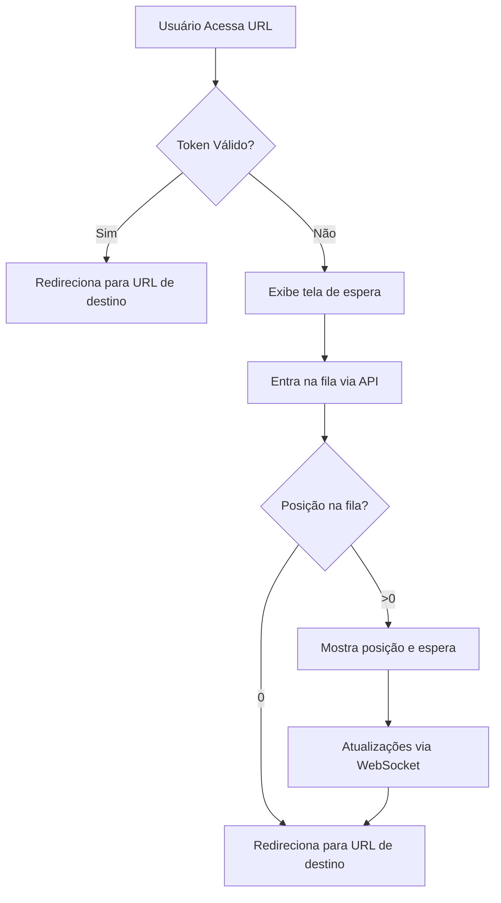
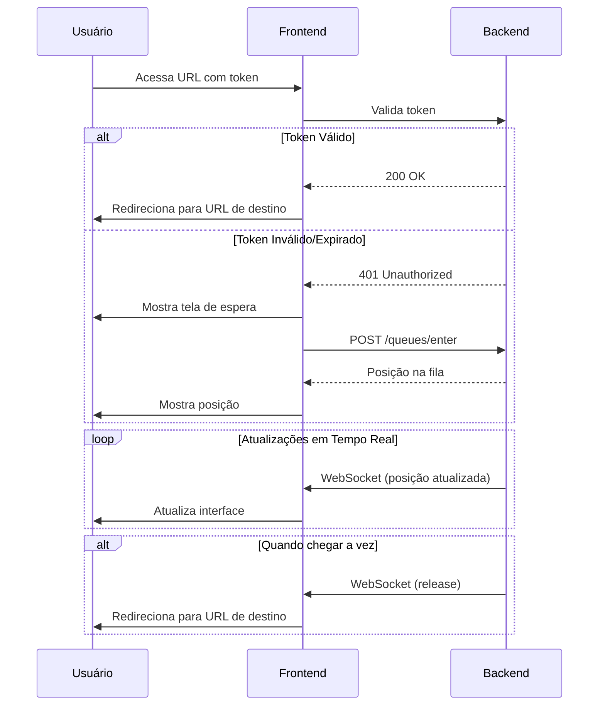

# 🚀 Sistema de Sala de Espera Virtual

<div align="center">
  
  []()
  [](LICENSE)
  []()
  []()
  []()
</div>

## 📋 Visão Geral

O Sistema de Sala de Espera Virtual é uma solução leve e eficiente para gerenciamento de filas de espera em ambientes digitais. O frontend em JavaScript puro se comunica com a API RESTful em Go, permitindo fácil hospedagem em qualquer CDN ou servidor web estático.

## 🎯 Funcionalidades

- ✅ Validação de acesso via token
- ⏱️ Sistema de fila em tempo real
- 🔄 Atualizações em tempo real via WebSocket
- 🚀 Frontend estático sem dependências externas
- 🔒 Sistema de autenticação por token JWT
- 🔄 Redirecionamento automático quando liberado

## 🏗️ Arquitetura

### Fluxo Principal



### Componentes

- **Frontend Estático**: Páginas HTML/JS estáticas que podem ser hospedadas em qualquer CDN
- **API REST**: Backend em Go que gerencia a fila de espera
- **Redis**: Armazenamento em memória para gerenciamento de sessões e filas

## 🚀 Tecnologias Utilizadas

### Backend
- **Linguagem**: Go (Golang)
- **Framework**: Gorilla Mux
- **WebSocket**: Gorilla WebSocket
- **Cache**: Redis
- **Autenticação**: JWT (JSON Web Tokens)
- **Containerização**: Docker

### Frontend
- **Tecnologia**: JavaScript Vanilla
- **Comunicação**: Fetch API + WebSocket
- **Hospedagem**: Qualquer CDN ou servidor estático
- **Dependências**: Zero dependências externas

## 🛠️ Instalação

### Pré-requisitos

- Go 1.20+ (apenas para o backend)
- Docker e Docker Compose (opcional)
- Redis 7.0+

### Configuração do Backend

1. **Clone o repositório**
   ```bash
   git clone https://github.com/seu-usuario/waiting-room.git
   cd waiting-room
   ```

2. **Configure as variáveis de ambiente**
   Crie um arquivo `.env` na raiz do projeto:
   ```env
   PORT=8000
   REDIS_URL=redis://localhost:6379
   JWT_SECRET=sua_chave_secreta_aqui
   TARGET_URL=https://sua-url-de-destino.com
   ```

3. **Inicie os serviços**
   ```bash
   # Com Docker (recomendado)
   docker-compose up -d
   
   # Ou manualmente
   go run main.go
   ```

### Configuração do Frontend

1. **Hospede os arquivos estáticos**
   - Copie a pasta `web` para seu servidor web ou CDN
   - Atualize a URL da API no arquivo `app.js` se necessário
   
2. **Acesse a aplicação**
   ```
   http://seu-servidor.com/?token=SEU_TOKEN_AQUI
   ```

## 📚 Documentação da API

### Endpoints Principais

| Método | Endpoint | Descrição |
|--------|----------|------------|
| `POST` | `/api/v1/queues/enter` | Entra na fila de espera |
| `GET`  | `/api/v1/queues/position` | Verifica a posição na fila |
| `POST` | `/api/v1/queues/exit` | Sai da fila (quando liberado) |

### WebSocket Events

- `connect`: Estabelece conexão
- `join`: Entra na fila
- `releaseEntry`: Libera o usuário para acessar o conteúdo

## 📊 Fluxo da Aplicação

### 1. Fluxo de Acesso


## 🧪 Testes

Para executar os testes do backend:

```bash
# Na raiz do projeto
go test -v ./...
```

Para testar o frontend, basta abrir o arquivo `index.html` em um navegador ou servidor web.

## 🤝 Contribuição

Contribuições são bem-vindas! Siga estes passos:

1. Faça um Fork do projeto
2. Crie uma Branch para sua Feature (`git checkout -b feature/AmazingFeature`)
3. Adicione suas mudanças (`git add .`)
4. Comite suas mudanças (`git commit -m 'Add some AmazingFeature'`)
5. Faça o Push da Branch (`git push origin feature/AmazingFeature`)
6. Abra um Pull Request

## 📄 Licença

Distribuído sob a licença MIT. Veja `LICENSE` para mais informações.

## 🙏 Agradecimentos

- [Gorilla Web Toolkit](https://www.gorillatoolkit.org/)
- [Mermaid.js](https://mermaid-js.github.io/) para os diagramas
